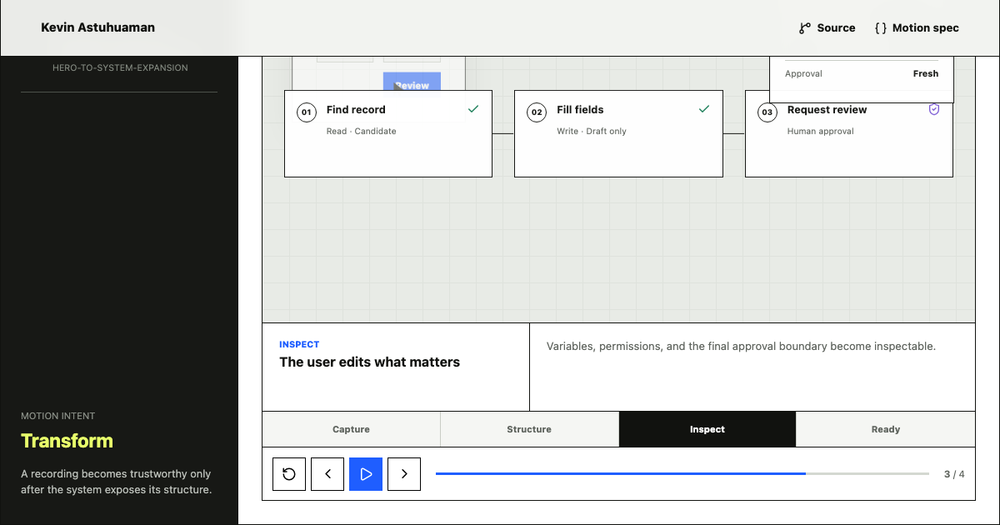

# AI Product Motion Studies

[Live artifact](https://kevinastuhuaman.github.io/ai-product-motion-studies/) · [Motion spec](https://kevinastuhuaman.github.io/ai-product-motion-studies/motion-spec.json) · [LLM context](https://kevinastuhuaman.github.io/ai-product-motion-studies/llms.txt)

Three original product-motion studies by [Kevin Astuhuaman](https://portfolio.kevinastuhuaman.com). Each sequence uses motion to explain a product decision: how a recording becomes an inspectable workflow, how a failed run reaches accountable recovery, and how one product object changes interaction across web, macOS, mobile, CLI, and MCP.

## What to inspect

- **Recording to workflow:** actions expand into named steps, variables, permissions, and a validation state.
- **Failure to recovery:** a stale prepared action fails closed, moves to an accountable owner, and resumes from the blocked step.
- **System to surfaces:** one normalized record remains recognizable while each interface prioritizes a different user decision.
- Select any state directly, pause or advance the sequence, and enable the reduced-motion equivalent.

## Motion decisions

- **One attention target per state.** Each transition has one dominant intent: transform, sequence, or expand.
- **Continuity carries causality.** Stable shells and objects help the viewer name the exact variable that changed.
- **Failure moves authority.** The review state shows the changed field, the policy reason, the owner, and the recovery path.
- **Surface parity is not UI duplication.** Shared product truth survives while interaction density changes.
- **The static frame still works.** Every sequence is fully inspectable without autoplay or animation.

## Motion contract

**src/data/motion-spec.json** is the single source for studies, states, timing, continuity objects, entry and exit objects, transition intent, and reduced-motion equivalents. **npm run validate:motion** checks the contract before deployment.

The timing values are recommended design decisions for this original artifact. They are not claims about an Apple reference deck or a native Keynote file.

## Public boundary

The project uses original interface elements and synthetic data. It contains no Trackly production code, applicant data, employer assets, private prompts, credentials, or confidential infrastructure. See [IP-NOTICE.md](IP-NOTICE.md).

## Run locally

    npm install
    npx playwright install chromium
    npm run validate:motion
    npm test
    npm run build
    npm run dev

The project uses Astro, TypeScript, Playwright, and Axe. GitHub Actions builds and deploys the static product to GitHub Pages.

## More evidence

- [Kevin's portfolio](https://portfolio.kevinastuhuaman.com)
- [Human Control Plane](https://kevinastuhuaman.github.io/human-in-the-loop-patterns/)
- [Agent Workflow Canvas](https://kevinastuhuaman.github.io/agent-workflow-canvas/)
- [Evals Control Room](https://kevinastuhuaman.github.io/evals-control-room/)

